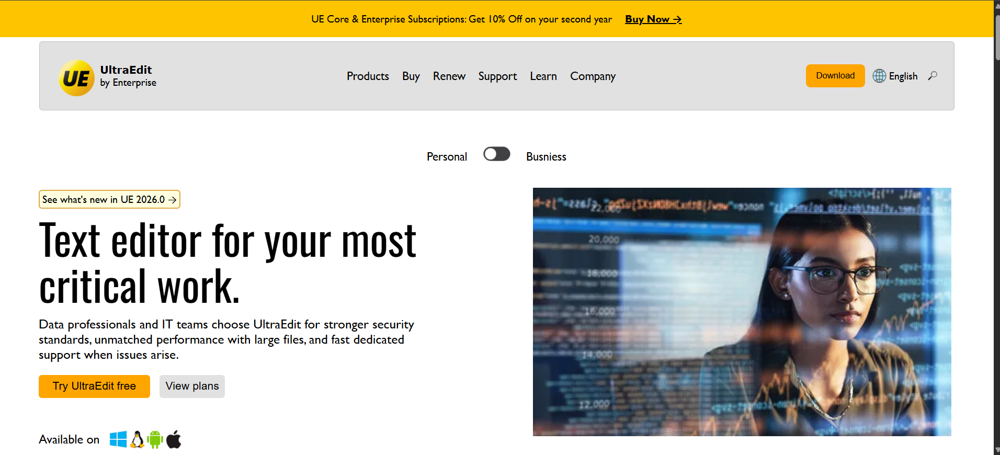

# UltraEdit Clone



A modern, responsive clone of the UltraEdit landing page built using HTML and CSS. This project focuses on responsive layouts, clean UI design, CSS Grid, Flexbox, animations, and GitHub deployment.

---

## 🌐 Live Demo

🔗 https://16vinayak.github.io/ultraedit-clone/

---

## 📸 Preview

(Add `screenshot.png` in the repository root.)

---

# ✨ Features

- 📱 Fully Responsive Design (320px+)
- 🎨 Modern UI inspired by UltraEdit
- 📌 Sticky Announcement Bar
- 🧭 Responsive Navigation Bar
- 🖥 Hero Section
- 🎞 CSS Image Slideshow Animation
- 📦 CSS Grid Layout
- 📐 Flexbox Layout
- 📲 Mobile Friendly
- ⚡ Optimized Performance

---

# 🛠 Built With

- HTML5
- CSS3
- CSS Grid
- Flexbox
- CSS Animations
- Media Queries
- Git
- GitHub
- GitHub Pages

---

# 📊 Lighthouse Report

## Desktop

| Category | Score |
|-----------|------:|
| Performance | 98 |
| Accessibility | 81 |
| Best Practices | 96 |
| SEO | 91 |

---

## Mobile

| Category | Score |
|-----------|------:|
| Performance | 87 |
| Accessibility | 79 |
| Best Practices | 96 |
| SEO | 91 |

---

# 📁 Folder Structure

```
UltraEdit-Clone
│
├── index.html
├── style.css
├── screenshot.png
├── README.md
│
├── assets/
│   ├── images/
│   └── icons/
│
└── fonts/
```

---

# 📚 What I Learned

While building this project I learned:

- Semantic HTML
- Responsive Web Design
- CSS Grid
- Flexbox
- CSS Animations
- Media Queries
- Sticky Navigation
- Layout Debugging
- Lighthouse Optimization
- Git & GitHub Workflow
- GitHub Pages Deployment

---

# 🚀 Future Improvements

- JavaScript Hamburger Menu
- Better Accessibility
- Dark Mode
- Smooth Scroll
- Improved Animations
- Pixel Perfect Design
- Search Interaction
- Download Page

---

# 💻 Run Locally

Clone the repository

```bash
git clone https://github.com/16vinayak/ultraedit-clone.git
```

Go to the project directory

```bash
cd ultraedit-clone
```

Open

```text
index.html
```

in your browser.

---

# 🤝 Contributing

Suggestions and feedback are always welcome.

If you find any issue, feel free to open an Issue or submit a Pull Request.

---

# 👨‍💻 Author

**Vinayak Pandey**

GitHub:
https://github.com/16vinayak

---

# ⭐ If you like this project

Please consider giving this repository a **Star ⭐**.

It helps motivate me to build more projects.

---

## 📌 Note

This project was built only for learning and portfolio purposes.

The original design inspiration belongs to **UltraEdit**.